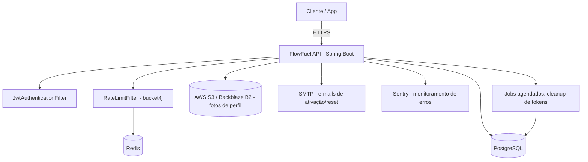

# FlowFuel API — Documentação

> Documentação gerada via engenharia reversa do código-fonte (`com.devappmobile.flowfuel`), seguindo o processo spec-driven descrito em [CLAUDE.md](../CLAUDE.md). Regras de negócio não explícitas no código estão marcadas `[INFERIDO]`.

## Visão Geral

FlowFuel é uma API REST (Spring Boot) para controle de abastecimentos e custos de veículos (combustão, elétrico e híbrido). Um usuário autenticado cadastra seus veículos, registra abastecimentos e eventos (manutenção, seguro, taxas, etc.) e consulta um dashboard com estatísticas agregadas de consumo e gasto por veículo. Autenticação é via JWT (access + refresh token opaco), com fluxo de ativação de conta por e-mail e reset de senha.

## Arquitetura de Alto Nível

## Índice

### Inventário
- [Fase 1 — Inventário de Endpoints, Middlewares, Entidades e Integrações](inventory.md)

### Especificação Técnica
- [OpenAPI 3.0 (openapi.yaml)](spec/openapi.yaml)

### Fluxos de Negócio
- [Cadastro e Ativação de Usuário](business-flows/cadastro-e-ativacao-de-usuario.md)
- [Autenticação (Login / Refresh / Logout)](business-flows/autenticacao.md)
- [Reset de Senha](business-flows/reset-de-senha.md)
- [Perfil de Usuário](business-flows/perfil-de-usuario.md)
- [Gestão de Veículos](business-flows/gestao-de-veiculos.md)
- [Abastecimentos (Refuels)](business-flows/abastecimentos.md)
- [Eventos de Veículo](business-flows/eventos-de-veiculo.md)
- [Dashboard de Estatísticas do Veículo](business-flows/dashboard.md)

### Fluxos de Endpoint (Técnico)
- [Autenticação e Usuário](endpoint-flows/autenticacao-e-usuario.md)
- [Veículos](endpoint-flows/veiculos.md)
- [Abastecimentos](endpoint-flows/abastecimentos.md)
- [Eventos de Veículo](endpoint-flows/eventos-de-veiculo.md)
- [Dashboard](endpoint-flows/dashboard.md)

### Roadmap de Melhorias
- [Visão geral do roadmap (bugs e débitos técnicos encontrados durante a documentação)](roadmap/README.md)

## Glossário

| Termo | Significado |
|---|---|
| **Veículo ativo** | Veículo marcado como "atual" pelo usuário; usado como padrão em telas/consultas quando nenhum `vehicleId` é especificado |
| **Abastecimento (Refuel)** | Registro de reabastecimento (combustível ou energia elétrica) com quantidade, preço unitário e total calculado |
| **Evento de veículo** | Registro de manutenção, seguro, troca de óleo, lavagem, pneus, taxas, documentos ou outro custo associado ao veículo |
| **Token opaco** | Token aleatório entregue ao cliente; apenas seu hash SHA-256 é persistido no banco (usado em refresh, ativação e reset de senha) |
| **PENDING_ACTIVATION / ACTIVE** | Estados do `UserStatus`; usuário só pode logar após ativar a conta via link enviado por e-mail |
| **EnergyType** | Tipo de energia do veículo: `COMBUSTION`, `ELECTRIC`, `HYBRID` |
| **`[INFERIDO]`** | Marcação para regras de negócio deduzidas do comportamento do código, não explícitas (ex: validação ausente, comentário, doc oficial) — requer confirmação com o time |

## Pontos de Atenção Consolidados

> Itens descobertos durante a documentação que merecem atenção do time (ver detalhes nos documentos de origem):

- Inconsistência entre os paths reais dos controllers (sem prefixo `/api/v1`) e as strings de whitelist do `JwtAuthenticationFilter`/`SecurityConfig` (com prefixo `/api/v1/auth/...`) — ver [inventory.md](inventory.md#pontos-de-atenção).
- Inconsistência de status code em operações de delete entre `UserController` (204) e os demais controllers (200 com corpo vazio).
- `VehicleEventType.FUEL` possivelmente redundante com `RefuelType.FUEL`.
- Itens de roadmap já identificados e endereçados (bugs e melhorias técnicas) estão detalhados em [roadmap/README.md](roadmap/README.md).
