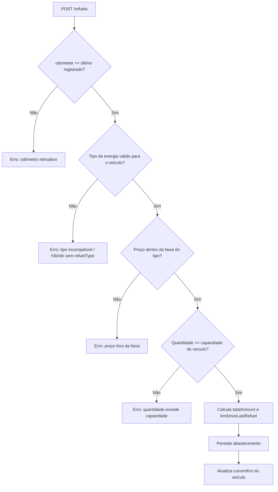

# Abastecimentos (Refuels)

> Fonte: `refuel/RefuelController.java`, `refuel/RefuelService.java`, `refuel/Refuel.java`

## Objetivo de Negócio

Registrar cada abastecimento (combustível ou energia elétrica) de um veículo, garantindo consistência do odômetro e dos valores informados, para alimentar as estatísticas de consumo do Dashboard.

## Atores

- **Usuário final (dono do veículo)** — registra, edita e exclui abastecimentos.
- **Sistema (RefuelService)** — valida odômetro, tipo de energia compatível, faixa de preço e capacidade; calcula valor total.

## Fluxo: Criar Abastecimento (`POST /refuels`)

**Pré-condições:** Veículo pertence ao usuário autenticado.

**Passos principais:**
1. Usuário informa `vehicleId`, `odometer` (>= 0), `energyAmount` (>= 0,01) e `pricePerUnit` (>= 0,01); opcionalmente `fullTank` (default `false`) e `refuelType`.
2. Sistema obtém o último odômetro registrado (do abastecimento mais recente ou, na ausência de histórico, do `currentKm` do veículo) e valida que o novo odômetro é **maior ou igual**.
3. Sistema resolve o tipo de energia do abastecimento:
   - Veículo `COMBUSTION` → tipo `FUEL` implícito.
   - Veículo `ELECTRIC` → tipo `ELECTRIC` implícito.
   - Veículo `HYBRID` → **`refuelType` é obrigatório** na requisição (erro se omitido).
   - Tipo informado deve ser compatível com o veículo (ex.: veículo `COMBUSTION` não aceita `ELECTRIC`).
4. Sistema valida que `pricePerUnit` está dentro da faixa aceitável para o tipo:
   - `FUEL`: R$ 0,50 a R$ 15,00 por litro.
   - `ELECTRIC`: R$ 0,10 a R$ 5,00 por kWh.
5. Sistema valida `energyAmount` contra a capacidade do veículo (tanque ou bateria), se cadastrada — se a capacidade não estiver definida, qualquer quantidade é aceita.
6. `totalAmount` é calculado automaticamente (`energyAmount × pricePerUnit`).
7. `kmSinceLastRefuel` é calculado (`odometer atual - último odometer`).
8. `refuelDate` é definido automaticamente pelo servidor (não vem da requisição).
9. **Efeito colateral:** o `currentKm` do veículo é atualizado para o odômetro informado no abastecimento.

**Caminhos alternativos / exceções de negócio:**
- Odômetro menor que o último registrado → erro de regra de negócio.
- Veículo híbrido sem `refuelType` informado → erro ("Veículo híbrido exige refuelType").
- Tipo de energia incompatível com o veículo → erro de regra de negócio.
- Preço fora da faixa permitida para o tipo → erro de regra de negócio.
- Quantidade de energia maior que a capacidade do veículo (quando capacidade definida) → erro de regra de negócio.

**Pós-condições:** Novo abastecimento persistido; `currentKm` do veículo atualizado; estatísticas do Dashboard refletem o novo registro.

## Fluxo: Atualizar Abastecimento (`PUT /refuels/{id}`)

**Passos principais:**
1. Campos são todos opcionais — apenas os enviados são alterados.
2. Se o odômetro for alterado: sistema recalcula `kmSinceLastRefuel` em relação ao abastecimento anterior (por data) e revalida que não é menor que o anterior.
3. Se `energyAmount` for alterado: revalida contra a capacidade do veículo.
4. Se `pricePerUnit` for alterado: revalida a faixa de preço.

**Pós-condições / efeito colateral notável:** a atualização **não recalcula nem atualiza o `currentKm` do veículo** — diferente da criação.

## Fluxo: Excluir Abastecimento (`DELETE /refuels/{id}`)

**Passos principais:**
1. Registro é excluído do banco.

**Pós-condições / efeito colateral notável:** a exclusão **não ajusta o `currentKm` do veículo**, que permanece refletindo o odômetro do abastecimento excluído.

## Diagrama (Criação de abastecimento)

## Pontos de Atenção

- **Inconsistência identificada:** ao atualizar ou excluir um abastecimento, o `currentKm` do veículo não é recalculado/ajustado, podendo ficar desalinhado com o histórico real de abastecimentos. `[descoberto no código — confirmar se é comportamento aceitável ou bug]`
- `kmSinceLastRefuel` é calculado apenas na criação; atualizações de odômetro recalculam o valor, mas a consistência geral da cadeia de abastecimentos (efeito cascata sobre o próximo registro) não é garantida. `[INFERIDO]`
