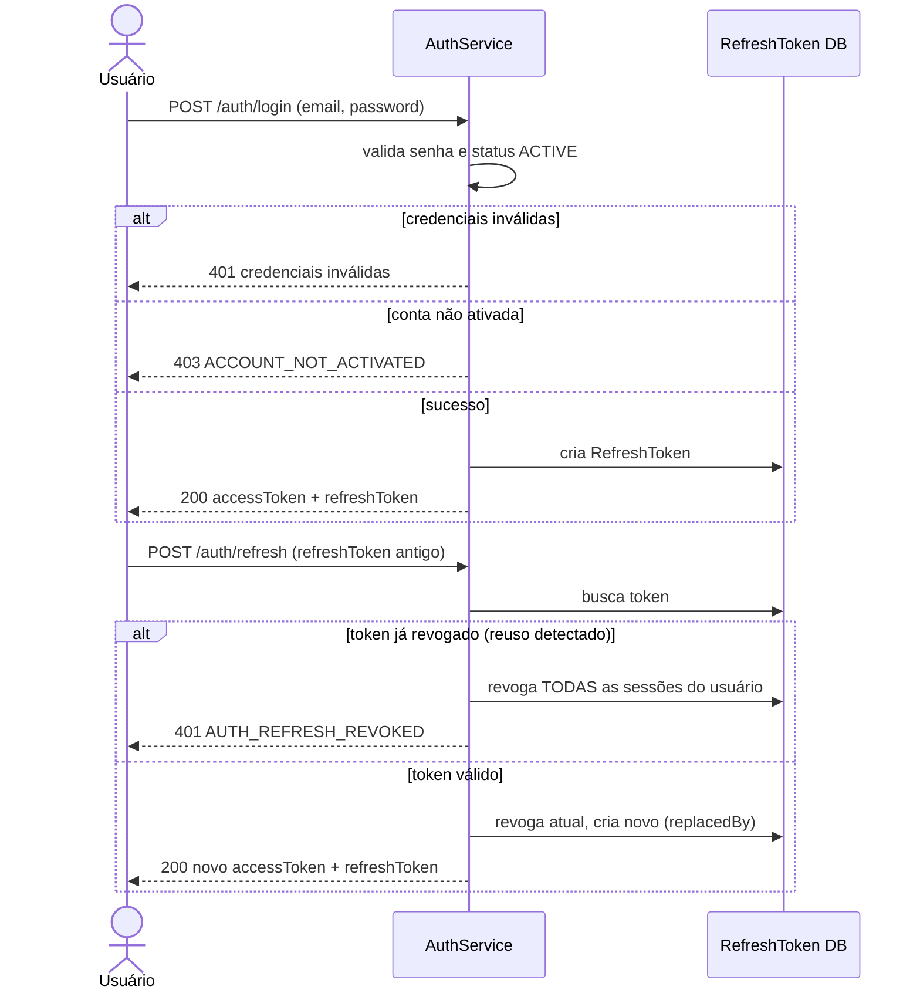

# Autenticação (Login / Refresh / Logout)

> Fonte: `user/UserController.java`, `user/AuthService.java`, `user/RefreshTokenService.java`, `user/RefreshToken.java`

## Objetivo de Negócio

Autenticar usuários ativos via e-mail/senha, emitir tokens JWT de acesso e refresh tokens rotativos, e permitir logout seguro revogando sessões.

## Atores

- **Usuário final** — faz login, usa o app, renova sessão, faz logout.
- **Sistema (AuthService / RefreshTokenService)** — valida credenciais, emite/rotaciona/revoga tokens.

## Fluxo: Login (`POST /auth/login`)

**Pré-condições:** Usuário possui conta com `status = ACTIVE`.

**Passos principais:**
1. Usuário envia `email` e `password`.
2. Sistema busca usuário por e-mail e compara a senha (hash) informada.
3. Sistema verifica se `user.status == ACTIVE`.
4. Sistema gera um **access token JWT** (TTL definido por `jwtUtil.getAccessTokenTtlMs()`) e emite um **refresh token** opaco (TTL configurável via `jwt.refresh-token-ttl-ms`, padrão 30 dias).
5. Resposta retorna `accessToken`, `refreshToken` e `expiresInSeconds`.

**Caminhos alternativos / exceções de negócio:**
- E-mail não encontrado ou senha incorreta → erro de credenciais inválidas ("Email ou senha inválidos") — **mesma mensagem genérica em ambos os casos**, evitando enumeração de e-mails.
- Conta existe mas não está ativa (`PENDING_ACTIVATION`) → erro `ACCOUNT_NOT_ACTIVATED` ("Conta não ativada. Verifique seu email para ativar a conta.").

**Pós-condições:** Usuário autenticado possui um par de tokens válido para acessar endpoints protegidos.

## Fluxo: Refresh (`POST /auth/refresh`)

**Passos principais:**
1. Cliente envia o refresh token vigente.
2. Sistema localiza o token e verifica se está válido (não revogado, não expirado).
3. Em caso de sucesso: o token atual é marcado como revogado e vinculado ao novo via campo `replacedBy`; um novo par access+refresh é emitido (**rotação obrigatória a cada refresh**).

**Caminhos alternativos / exceções de negócio — Detecção de reuso:**
- Se o token apresentado já havia sido revogado anteriormente (ou seja, alguém está tentando reutilizar um refresh token "velho", sinal de possível roubo de token), o sistema **revoga TODAS as sessões ativas do usuário** como medida de segurança e retorna erro `AUTH_REFRESH_REVOKED` ("Refresh token revogado — sessões invalidadas por segurança"). O usuário precisa logar novamente em todos os dispositivos.

**Pós-condições:** Sessão estendida com novo par de tokens; token anterior inutilizado.

## Fluxo: Logout (`POST /auth/logout`)

**Pré-condições:** Usuário autenticado (Bearer token).

**Passos principais:**
1. Cliente envia o refresh token a ser revogado.
2. Sistema marca o token correspondente como revogado.
3. Se o token não for encontrado ou já estiver revogado, a operação é silenciosamente bem-sucedida (sem erro).

**Pós-condições:** Refresh token informado não pode mais ser usado para gerar novos access tokens.

## Diagrama (Login + Refresh com detecção de reuso)

## Pontos de Atenção

- Não há rate limiting/lockout por tentativas de login além do limite global de 5 req/min por IP (`RateLimitFilter`); não existe bloqueio de conta por tentativas inválidas repetidas. O roadmap (B5) menciona registro de tentativas de login, mas isso **não está implementado** no código revisado. `[INFERIDO — confirmar com time]`
- A inconsistência de prefixo de rota `/api/v1` documentada na Fase 1/2 também afeta estes endpoints — verificar path real antes de publicar a documentação técnica final.
