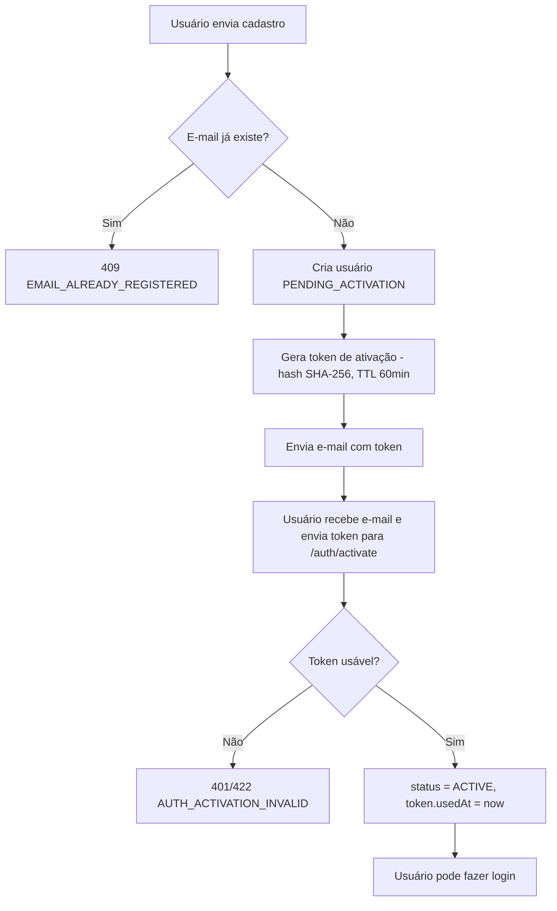

# Cadastro e Ativação de Usuário

> Fonte: `user/UserController.java`, `user/AuthService.java`, `user/AccountActivationService.java`, `user/UserRegisterDTO.java`

## Objetivo de Negócio

Permitir que um novo usuário crie uma conta no FlowFuel e a ative via token enviado por e-mail, garantindo que apenas e-mails válidos e acessíveis pelo titular possam efetuar login.

## Atores

- **Usuário final** — solicita cadastro e ativa a conta.
- **Sistema (AuthService / AccountActivationService)** — valida dados, cria conta, emite e invalida tokens.
- **Serviço externo SMTP** — entrega o e-mail de ativação.

## Fluxo: Cadastro (`POST /auth/register`)

**Pré-condições:** e-mail informado ainda não possui conta cadastrada.

**Passos principais:**
1. Usuário envia `email`, `password` (mín. 6 caracteres), e opcionalmente `name`, `phone`.
2. Sistema verifica se o e-mail já está cadastrado.
3. Senha é codificada (hash) e usuário é criado com `status = PENDING_ACTIVATION`.
4. Um token de ativação é gerado (valor opaco; apenas o hash SHA-256 é persistido) com TTL configurável (`flowfuel.account-activation.token-ttl-minutes`, padrão 60 min).
5. E-mail de ativação é disparado via SMTP com o token em texto plano.
6. Resposta de sucesso é retornada — **nenhum token de acesso é emitido neste passo**; o usuário não fica logado.

**Caminhos alternativos / exceções de negócio:**
- E-mail já cadastrado → erro `EMAIL_ALREADY_REGISTERED` (HTTP 409).
- Falha no envio do e-mail (SMTP indisponível/`MAIL_ENABLED=false`) → `[INFERIDO — confirmar com time]` comportamento exato (se a conta é criada mesmo assim) não está coberto por tratamento explícito de erro de envio.

**Pós-condições:** Conta existe em estado `PENDING_ACTIVATION`; usuário não pode logar até ativação.

## Fluxo: Ativação (`POST /auth/activate`)

**Pré-condições:** Usuário possui um token de ativação válido (recebido por e-mail).

**Passos principais:**
1. Usuário envia o token em texto plano.
2. Sistema calcula o hash SHA-256 e busca o token correspondente.
3. Token deve estar "usável" (não usado e não expirado).
4. Conta passa para `status = ACTIVE`; token é marcado como usado (`usedAt`).

**Caminhos alternativos / exceções de negócio:**
- Token ausente/vazio, inexistente, expirado ou já usado → erro `AUTH_ACTIVATION_INVALID` ("Token de ativação inválido ou expirado").

**Pós-condições:** Usuário pode realizar login normalmente.

## Fluxo: Reenvio de Ativação (`POST /auth/resend-activation`)

**Passos principais:**
1. Usuário informa o e-mail.
2. **Proteção contra enumeração de e-mail:** a resposta de sucesso é idêntica independentemente de o e-mail existir, já estar ativo, ou estar pendente — o sistema nunca revela se o e-mail está cadastrado.
3. Se a conta existir e estiver pendente: todos os tokens de ativação anteriores são invalidados e um novo token é gerado e enviado por e-mail.
4. Em ambiente de desenvolvimento (`flowfuel.account-activation.expose-token=true`), o token também é devolvido na resposta da API; em produção esse campo vem nulo.

**Pós-condições:** Se aplicável, um novo token de ativação válido substitui os anteriores.

## Diagrama (Cadastro + Ativação)

## Pontos de Atenção

- Comportamento exato quando o envio de e-mail (SMTP) falha após a criação da conta não está claramente tratado no código revisado. `[INFERIDO — confirmar com time]`
- `expose-token` em modo dev devolve o token de ativação na resposta da API — garantir que essa flag nunca seja `true` em produção.
