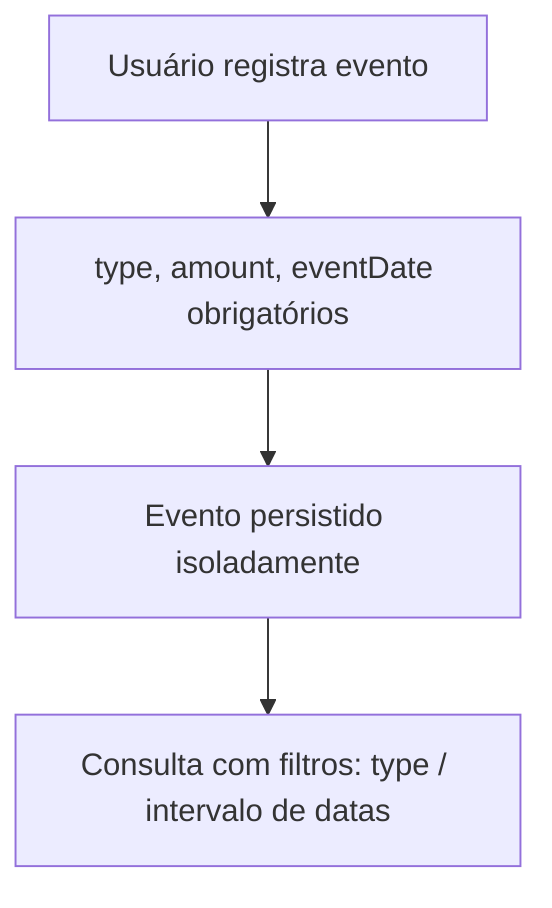

# Eventos de Veículo (Vehicle Events)

> Fonte: `vehicleevent/VehicleEventController.java`, `vehicleevent/VehicleEventService.java`, `vehicleevent/VehicleEvent.java`

## Objetivo de Negócio

Permitir o registro de despesas e ocorrências do veículo que não são abastecimentos — manutenção, troca de óleo, seguro, IPVA, documentos, etc. — para histórico financeiro e de manutenção do veículo.

## Atores

- **Usuário final (dono do veículo)** — registra, edita, exclui e consulta eventos.
- **Sistema (VehicleEventService)** — valida dados e aplica filtros de consulta.

## Fluxo: Criar Evento (`POST /vehicle-events`)

**Passos principais:**
1. Usuário informa `vehicleId`, `type` (`FUEL`, `MAINTENANCE`, `OIL_CHANGE`, `CAR_WASH`, `TIRES`, `INSURANCE`, `TAX`, `DOCUMENTS`, `OTHER`), `amount` (>= 0,01) e `eventDate` (data passada ou presente).
2. Campos opcionais: `odometer` (>= 0), `description` (até 2000 caracteres).
3. Evento é persistido sem cálculos ou validações adicionais específicas por tipo.

**Pós-condições:** Evento disponível no histórico do veículo, sem qualquer vínculo automático com abastecimentos.

## Fluxo: Listar Eventos (`GET /vehicle-events/vehicle/{vehicleId}`)

**Passos principais:**
1. Suporta filtros opcionais combináveis: `type`, intervalo de datas (`startDate`/`endDate`).
2. Resultado paginado, ordenado por `eventDate` desc, depois `createdAt` desc, depois `id` desc.

## Fluxo: Atualizar / Excluir Evento

- Atualização: todos os campos são opcionais; apenas os enviados são alterados.
- Exclusão: remoção simples do registro, sem efeitos colaterais em outras entidades.

## Diagrama

## Pontos de Atenção

- **`VehicleEventType.FUEL` não está conectado ao fluxo de [Abastecimentos](abastecimentos.md):** criar um abastecimento via `POST /refuels` não gera automaticamente um evento `FUEL`, e vice-versa. Os dois fluxos são streams de dados completamente independentes, apesar do nome do tipo sugerir uma relação. `[descoberto no código — confirmar com time se a duplicidade de modelagem é intencional ou se deveria haver sincronização]`
- Não há validação de unicidade ou de coerência entre `odometer` informado no evento e o odômetro real do veículo no momento — diferente do fluxo de abastecimentos, que valida isso estritamente.
