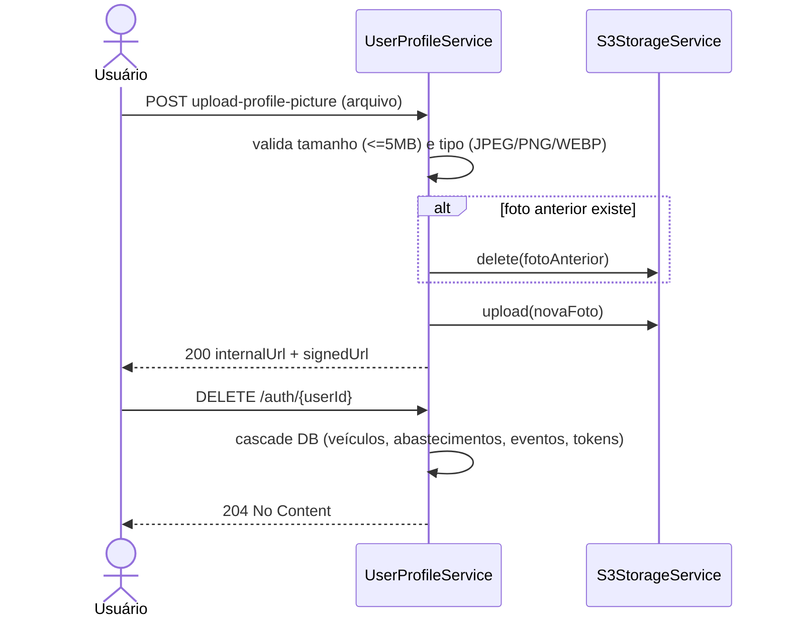

# Perfil de Usuário

> Fonte: `user/UserController.java`, `user/UserProfileService.java`, `user/AuthService.java`, `storage/S3StorageService.java`

## Objetivo de Negócio

Permitir que o usuário autenticado consulte e gerencie seus próprios dados de perfil, foto de perfil e senha, e exclua sua conta — sempre restrito ao próprio usuário (`ensureSelf()`).

## Atores

- **Usuário final (dono da conta)** — único ator autorizado a operar sobre o próprio perfil.
- **Sistema (UserProfileService / AuthService)** — valida e aplica alterações.
- **AWS S3 / Backblaze B2** — armazena a foto de perfil; gera URLs assinadas (15 min) para leitura.

## Fluxo: Consultar Perfil (`GET /auth/{userId}/profile`)

**Pré-condições:** `userId` da URL deve ser o mesmo do usuário autenticado.

**Passos principais:**
1. Sistema retorna `id`, `email`, `name`, `phone`, caminho interno da foto e uma URL assinada (S3) para exibição da foto, se houver.

**Caminhos alternativos:**
- Tentativa de acessar perfil de outro usuário → erro de operação proibida ("Você não pode operar sobre outro usuário").

## Fluxo: Atualizar Perfil (`PUT /auth/{userId}/profile`)

**Passos principais:**
1. Usuário envia campos opcionais: `email`, `name`, `phone`.
2. Se `email` for alterado: sistema verifica se o novo e-mail já está em uso por outra conta.
3. Campos informados são atualizados; campos omitidos permanecem inalterados.

**Caminhos alternativos / exceções de negócio:**
- Novo e-mail já cadastrado por outro usuário → `EMAIL_ALREADY_REGISTERED` (409).
- E-mail enviado como string vazia → erro de validação (campo não pode ser vazio quando presente).

## Fluxo: Alterar Senha (`PUT /auth/{userId}/password`)

**Passos principais:**
1. Usuário envia senha atual e nova senha (mín. 6 caracteres).
2. Sistema valida que a senha atual informada corresponde à senha salva.
3. Sistema valida que a nova senha é **diferente** da atual.
4. Senha é atualizada (hash).
5. **Todas as sessões do usuário são revogadas** (todos os refresh tokens) — efeito colateral: logout forçado em todos os dispositivos.

**Caminhos alternativos / exceções de negócio:**
- Senha atual incorreta → erro de credenciais inválidas.
- Nova senha igual à atual → erro de regra de negócio ("Nova senha deve ser diferente da atual").

## Fluxo: Foto de Perfil

### Upload (`POST /auth/{userId}/upload-profile-picture`)
1. Validações: tamanho máximo 5 MB; tipos aceitos JPEG/PNG/WEBP; arquivo não pode estar vazio.
2. Se já existir foto anterior, ela é removida do S3 antes do novo upload.
3. Nome do arquivo é sanitizado e gravado como `profile_pictures/{userId}_{nome_sanitizado}`.
4. Resposta retorna URL interna (`/auth/{userId}/profile-picture`) e URL assinada do S3.

### Download (`GET /auth/{userId}/profile-picture`)
- Se o usuário não tiver foto: retorna 204 No Content.
- Caso contrário: faz streaming dos bytes da imagem com o `Content-Type` correto.

### Remoção (`DELETE /auth/{userId}/profile-picture`)
- Remove o arquivo do S3 e limpa a referência no perfil do usuário.

## Fluxo: Exclusão de Conta (`DELETE /auth/{userId}`)

**Passos principais:**
1. Usuário confirma exclusão da própria conta.
2. Conta é removida do banco.
3. **Cascade automático em nível de banco** (`@OnDelete(CASCADE)`): veículos, abastecimentos, eventos de veículo, tokens de ativação, tokens de reset de senha e refresh tokens do usuário são todos excluídos junto.

**Pós-condições:** Toda informação vinculada ao usuário é permanentemente removida — **operação é hard delete, sem soft delete ou período de retenção**. `[INFERIDO — confirmar com time se esse é o comportamento desejado, já que não há recuperação de conta após exclusão]`

## Diagrama (Upload de foto + exclusão de conta)

## Pontos de Atenção

- Exclusão de conta é definitiva (hard delete via cascade) — não há soft delete nem confirmação adicional (ex: senha, e-mail de confirmação) documentada no código revisado. `[INFERIDO]`
- Limites de tamanho do multipart do Spring podem rejeitar uploads antes da validação de 5MB do serviço, potencialmente retornando um erro genérico (`MultipartException`) não tratado explicitamente. `[INFERIDO — confirmar com time]`
