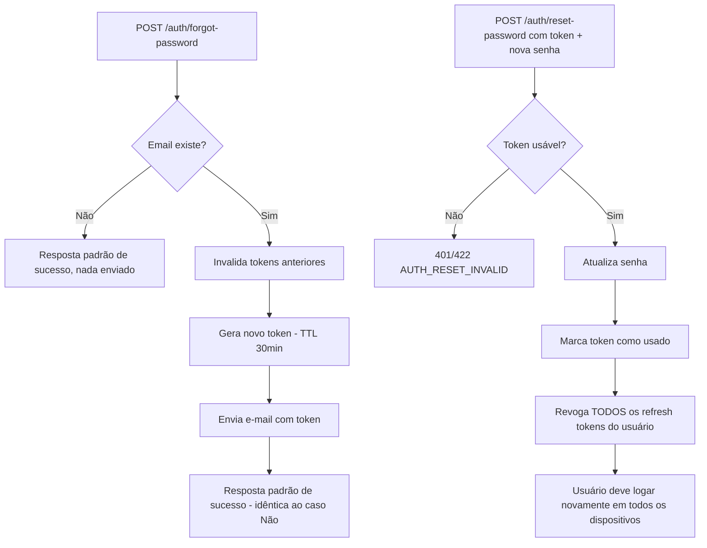

# Reset de Senha

> Fonte: `user/UserController.java`, `user/PasswordResetService.java`

## Objetivo de Negócio

Permitir que um usuário recupere o acesso à conta quando esquece a senha, sem expor se um e-mail está ou não cadastrado no sistema (proteção contra enumeração).

## Atores

- **Usuário final** — solicita o reset e define a nova senha.
- **Sistema (PasswordResetService)** — gera/valida tokens, atualiza a senha, revoga sessões.
- **Serviço externo SMTP** — entrega o e-mail com o link/token de reset.

## Fluxo: Solicitar Reset (`POST /auth/forgot-password`)

**Passos principais:**
1. Usuário informa o e-mail.
2. **Proteção contra enumeração:** se o e-mail não existir, o sistema registra um log interno e ainda assim retorna a mesma resposta de sucesso padrão ("Se houver uma conta associada a este email, enviaremos instruções de redefinição de senha.").
3. Se o e-mail existir: todos os tokens de reset anteriores são invalidados, um novo token é gerado (hash SHA-256 persistido, TTL configurável via `flowfuel.password-reset.token-ttl-minutes`, padrão 30 min) e enviado por e-mail.
4. Em modo dev (`flowfuel.password-reset.expose-token=true`) o token também volta na resposta da API; em produção, não.

**Pós-condições:** Se a conta existir, há um token de reset válido por até 30 minutos.

## Fluxo: Concluir Reset (`POST /auth/reset-password`)

**Pré-condições:** Usuário possui um token de reset válido (recebido por e-mail).

**Passos principais:**
1. Usuário envia o token e a nova senha.
2. Sistema calcula o hash do token e verifica se está "usável" (não usado e não expirado).
3. Senha do usuário é atualizada (hash).
4. Token é marcado como usado.
5. **Todos os refresh tokens do usuário são revogados** — efeito colateral de segurança: o usuário é deslogado de todos os dispositivos/sessões ativas.

**Caminhos alternativos / exceções de negócio:**
- Token ausente, inválido, expirado ou já usado → erro `AUTH_RESET_INVALID` ("Token de redefinição inválido ou expirado").

**Pós-condições:** Usuário pode logar com a nova senha; sessões antigas (refresh tokens) deixam de funcionar.

## Diagrama

## Pontos de Atenção

- A resposta de `forgot-password` é deliberadamente idêntica em ambos os casos (e-mail existente ou não) — isso é uma decisão de segurança correta, não um bug; manter esse comportamento em qualquer refator futuro.
- Nenhuma política de complexidade de senha é validada no reset além do mínimo de 6 caracteres aplicado no cadastro — `[INFERIDO — confirmar com time]` se reset-password aplica a mesma regra de tamanho mínimo.
