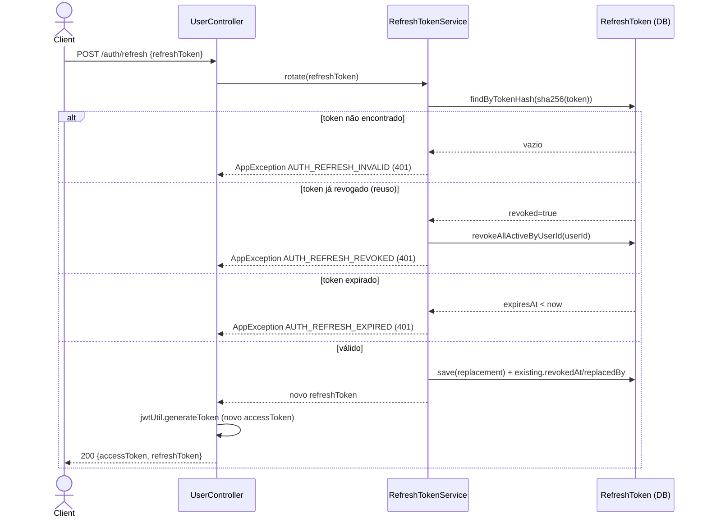
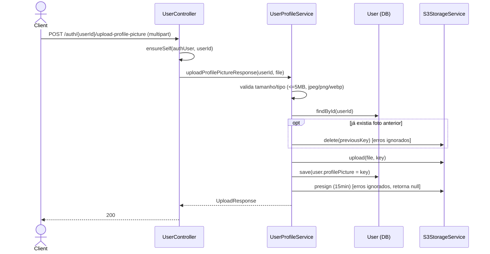

# Fluxo de Endpoints — Autenticação e Usuário

> Fonte: `user/UserController.java`, `user/AuthService.java`, `user/AccountActivationService.java`, `user/PasswordResetService.java`, `user/RefreshTokenService.java`, `user/UserProfileService.java`, `config/JwtAuthenticationFilter.java`, `config/SecurityConfig.java`, `config/RateLimitFilter.java`/`RateLimitingConfig.java`, `config/GlobalExceptionHandler.java`, `storage/S3StorageService.java`.

Controller: `UserController` está mapeado em `@RequestMapping("/auth")` (`UserController.java:16`) — **não** em `/api/v1/auth`. Ver `## Pontos de Atenção`.

## Cadeia de middleware (comum a todos os endpoints)

`RequestIdFilter` → `RateLimitFilter` (`config/RateLimitFilter.java:58-61`, só intercepta `POST` em paths cadastrados em `RateLimitingConfig`) → filtros de segurança do Spring → `JwtAuthenticationFilter` (`config/JwtAuthenticationFilter.java:35-101`, adicionado antes de `UsernamePasswordAuthenticationFilter`) → `UserController`.

- `JwtAuthenticationFilter.shouldNotFilter` e `SecurityConfig` (permitAll) usam as strings `/api/v1/auth/...` para isentar os endpoints públicos de autenticação.
- `RateLimitingConfig` usa as mesmas strings `/api/v1/auth/{login,register,forgot-password,resend-activation}` para aplicar os limites.
- Erros gerados pelo filtro JWT são escritos diretamente via `ProblemDetailWriter` (sem passar pelo `GlobalExceptionHandler`): header ausente/malformado → `AUTH_REQUIRED` (401); token inválido/expirado → `AUTH_TOKEN_INVALID` (401).

## 1. Cadastro e Ativação

### `POST /auth/register`

1. `UserController.register` (`:30-34`) → valida `UserRegisterDTO` (`email` `@NotBlank @Email`, `password` `@NotBlank @Size(min=6)`).
2. `AuthService.register` (`AuthService.java:29-44`): verifica duplicidade de e-mail (`userRepository.findByEmail`) → cria `User` com `status=PENDING_ACTIVATION`, senha em BCrypt → `save` → `AccountActivationService.sendActivation`.
3. `sendActivation` (`AccountActivationService.java:32-43`, `@Transactional`): invalida tokens de ativação anteriores, gera token opaco (hash SHA-256 persistido, valor bruto só na resposta/e-mail), salva `ActivationToken`, dispara `notifier.sendActivationLink` (SMTP real ou logger, conforme `flowfuel.mail.enabled`).
4. Retorna `201 Created` com `UserResponseDTO`.

**Erros:** e-mail duplicado → `ConflictException(EMAIL_ALREADY_REGISTERED)` 409 · falha de validação → `VALIDATION_FAILED` 400 · corrida de unicidade no banco → `DataIntegrityViolationException` → 409 `CONFLICT`.

### `POST /auth/activate`

`AccountActivationService.activate` (`:45-62`, `@Transactional`): token vazio → `AUTH_ACTIVATION_INVALID` 401. Busca `ActivationToken` por hash, exige `isUsable()` (não usado e não expirado) → senão mesmo erro 401. Sucesso: `User.status=ACTIVE`, marca `token.usedAt`. Retorna `204`. Não emite tokens de sessão (sem auto-login).

### `POST /auth/resend-activation`

`AccountActivationService.resendActivation` (`:64-76`, `@Transactional`) — resposta **uniforme** (`AccountActivationResponse.standard()`) independente do resultado, para evitar enumeração de e-mails: usuário inexistente ou já ativo → loga e retorna a mesma resposta padrão sem erro. Caso contrário repete os passos de `sendActivation`. Token bruto só é exposto se `flowfuel.account-activation.expose-token=true` (uso interno/dev).

## 2. Login / Sessão

### `POST /auth/login`

1. `UserController.login` (`:47-54`) valida `LoginRequest` (record interno, `email`/`password` `@NotBlank`).
2. `AuthService.login` (`:46-57`): busca usuário por e-mail e compara senha (BCrypt) em uma única cadeia — falha em qualquer um dos dois → `BadCredentialsException` (mensagem genérica, não revela qual campo errou) → 401 `AUTH_BAD_CREDENTIALS`.
3. Se encontrado mas `status != ACTIVE` → `AppException(ACCOUNT_NOT_ACTIVATED)` → 403.
4. `issueTokenPair` (`:96-101`): gera access token JWT (`jwtUtil.generateToken`) e refresh token opaco (`RefreshTokenService.issue`, hash SHA-256 persistido). Não revoga sessões anteriores — múltiplas sessões concorrentes são permitidas.
5. Controller define o access token também no header `Authorization: Bearer ...` **além** do corpo (`UserController.java:51-53`) — duplicação a observar.

### `POST /auth/refresh` — rotação com detecção de reuso

Fonte: `AuthService.refresh` (`AuthService.java:59-64`), `RefreshTokenService.rotate` (`RefreshTokenService.java:37-70`). Reuso de token revogado é tratado como possível roubo: todas as sessões ativas do usuário são revogadas.

**Atenção:** `/auth/refresh`, `/auth/logout` e `/auth/reset-password` não possuem entrada de rate limit em `RateLimitingConfig`, apesar de operarem sobre tokens sensíveis.

### `POST /auth/logout`

Não está na lista de isenção JWT nem no permitAll — exige Bearer válido mesmo operando sobre o refresh token do corpo. `RefreshTokenService.revoke` (`:72-82`, `@Transactional`): token vazio, inexistente ou já revogado → no-op silencioso, sempre `204`. Não invalida o access token (JWT stateless, expira pelo TTL próprio).

## 3. Senha

### `POST /auth/forgot-password`

`PasswordResetService.requestReset` (`:35-56`, `@Transactional`) — mesmo padrão anti-enumeração do resend-activation: resposta uniforme sempre `200`, e-mail inexistente é tratado silenciosamente. Se encontrado: invalida tokens de reset anteriores, gera novo token opaco, dispara notificação.

### `POST /auth/reset-password`

`PasswordResetService.reset` (`:58-77`, `@Transactional`): token vazio/inválido/expirado/usado → `AUTH_RESET_INVALID` 401. Sucesso: nova senha em BCrypt, marca token usado, **revoga todos os refresh tokens do usuário** (logout forçado em todos os dispositivos). `204`.

### `PUT /auth/{userId}/password`

Protegido + `ensureSelf(authUser, userId)` (`UserController.java:137-141`) — único mecanismo de autorização (sem papéis/admin). `AuthService.changePassword` (`:74-87`): usuário não encontrado → 404; senha atual incorreta → `BadCredentialsException` 401; nova senha igual à atual → `BusinessRuleException` 400 `BUSINESS_RULE_VIOLATED`. Sucesso: salva, revoga todos os refresh tokens.

## 4. Foto de Perfil (S3)

Fonte: `UserController.java:87-93`, `UserProfileService.java:72-115`. Validação manual (não Bean Validation): arquivo vazio/tipo fora da whitelist/tamanho acima de 5MB → `BusinessRuleException` 400. Usuário inexistente → 404. Falha do S3 (`S3StorageService.upload`, `S3StorageService.java:82-84`) é embrulhada em `RuntimeException` genérica, não `AppException` → cai no handler genérico → **500 `INTERNAL_ERROR`** em vez de um código de domínio.

`DELETE /auth/{userId}/profile-picture` (`UserProfileService.java:46-54`) não engole exceções do S3 (diferente do upload) — falha de delete propaga como 500.

## 5. Perfil e Exclusão

`GET`/`PUT /auth/{userId}/profile`: leitura/atualização de `name`/`phone`/`email`. Mudança de e-mail verifica duplicidade (`ConflictException(EMAIL_ALREADY_REGISTERED)` 409) mas **não exige reconfirmação** do novo e-mail.

`DELETE /auth/{userId}`: `AuthService.deleteUser` (`:89-94`) — hard delete (`existsById` + `deleteById`), sem soft-delete. Não há limpeza explícita de `RefreshToken`/`ActivationToken`/`PasswordResetToken`/foto no S3 — depende de cascade de banco não verificado neste código.

## Tabela de Erros → Status HTTP

| Exceção | Camada | Status | Code |
|---|---|---|---|
| Header `Authorization` ausente/malformado | `JwtAuthenticationFilter` | 401 | `AUTH_REQUIRED` |
| JWT inválido/expirado | `JwtAuthenticationFilter` | 401 | `AUTH_TOKEN_INVALID` |
| `MethodArgumentNotValidException` (Bean Validation) | Spring MVC | 400 | `VALIDATION_FAILED` |
| E-mail duplicado (register/profile) | `AuthService`/`UserProfileService` | 409 | `EMAIL_ALREADY_REGISTERED` |
| `BadCredentialsException` (login/change-password) | `AuthService` | 401 | `AUTH_BAD_CREDENTIALS` |
| Conta não ativada | `AuthService.login` | 403 | `ACCOUNT_NOT_ACTIVATED` |
| Token de ativação inválido/expirado/usado | `AccountActivationService` | 401 | `AUTH_ACTIVATION_INVALID` |
| Token de reset inválido/expirado/usado | `PasswordResetService` | 401 | `AUTH_RESET_INVALID` |
| Refresh token inválido | `RefreshTokenService` | 401 | `AUTH_REFRESH_INVALID` |
| Refresh token revogado (reuso) | `RefreshTokenService` | 401 | `AUTH_REFRESH_REVOKED` (+ revoga todas as sessões) |
| Refresh token expirado | `RefreshTokenService` | 401 | `AUTH_REFRESH_EXPIRED` |
| Nova senha igual à atual | `AuthService.changePassword` | 400 | `BUSINESS_RULE_VIOLATED` |
| Usuário/recurso não encontrado | vários services | 404 | `RESOURCE_NOT_FOUND` |
| `userId` do path ≠ usuário autenticado | `UserController.ensureSelf` | 403 | `FORBIDDEN_OPERATION` |
| Falha S3 (upload/download) | `S3StorageService` (exceção genérica não tratada) | 500 | `INTERNAL_ERROR` |
| Corrida de unicidade no banco | `DataIntegrityViolationException` | 409 | `CONFLICT` |

## Pontos de Atenção

- **Inconsistência de prefixo de rota:** o controller real expõe `/auth/...`, mas `SecurityConfig`, `JwtAuthenticationFilter.shouldNotFilter` e `RateLimitingConfig` usam `/api/v1/auth/...` na whitelist/limites — não há `context-path` configurado. `[INFERIDO — confirmar com time: se os endpoints "públicos" e o rate limiting realmente nunca disparam por esse descasamento]`.
- `/auth/refresh`, `/auth/logout`, `/auth/reset-password` não têm rate limit configurado, apesar de operarem sobre tokens sensíveis. `[descoberto na Fase 4]`
- `401` é usado tanto para credenciais inválidas quanto para token de ativação/reset expirado ou já usado — um `400`/`410` seria mais convencional para esses últimos casos. `[INFERIDO]`
- `DELETE /auth/{userId}` retorna `200` com corpo vazio (método `void` sem `ResponseEntity`), enquanto operações de delete "irmãs" (`/profile-picture`) retornam `204` explícito — inconsistência de status code. `[descoberto na Fase 2/4]`
- Corrida de e-mail duplicado no `PUT /profile` cai em `CONFLICT` genérico via `DataIntegrityViolationException`, diferente do `EMAIL_ALREADY_REGISTERED` retornado pela checagem prévia no service — dois códigos de erro para o mesmo cenário de negócio. `[descoberto na Fase 4]`
- Falhas do S3 (`S3StorageService`) são `RuntimeException` simples, não `AppException`, então caem no handler genérico (`500 INTERNAL_ERROR`) em vez de um código de domínio específico. `[descoberto na Fase 4]`
- Exclusão de usuário não limpa explicitamente tokens (`RefreshToken`/`ActivationToken`/`PasswordResetToken`) nem a foto de perfil no S3 — possível dado órfão se não houver cascade no banco. `[INFERIDO — confirmar com time]`
