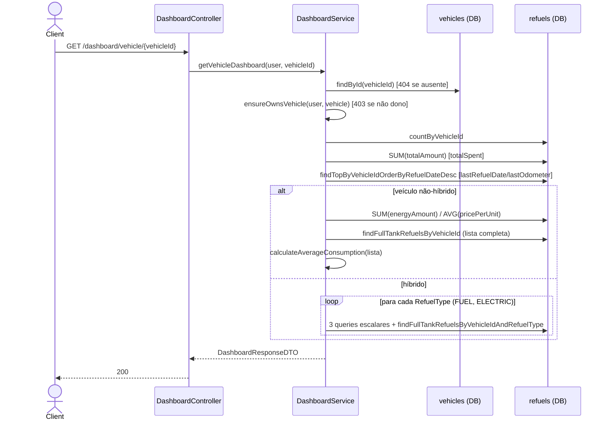

# Fluxo de Endpoints — Dashboard

> Fonte: `dashboard/DashboardController.java`, `dashboard/DashboardService.java`, `refuel/RefuelRepository.java`, `common/AuthorizationHelper.java`, `config/GlobalExceptionHandler.java`. Contexto adicional: `docs/roadmap/phase-2/M4-reconcile-average-consumption-formula.md`, `docs/roadmap/phase-2/M5-optimize-dashboard-service.md`.

Controller: `@RequestMapping("/dashboard")` + `@GetMapping("/vehicle/{vehicleId}")` (`DashboardController.java:9,15`). Único endpoint do recurso, somente leitura.

## `GET /dashboard/vehicle/{vehicleId}`

Fonte: `DashboardController.java:15-20`, `DashboardService.java:29-91`. Sem `@Transactional` — cada query roda isolada; em tese os dados podem mudar entre as leituras sequenciais de um mesmo request (risco baixo dado o padrão de uso). `[INFERIDO]`

### Fórmula de consumo médio (`calculateAverageConsumption`, `DashboardService.java:119-169`)

1. Ordena abastecimentos com `fullTank=true` por data decrescente.
2. Para cada par consecutivo (atual, anterior): `kmDriven = atual.odometer - anterior.odometer`; `energyUsed = atual.energyAmount`.
3. Soma apenas pares válidos (`kmDriven > 0 && energyUsed > 0`).
4. Resultado = `SUM(kmDriven) / SUM(energyUsed)`, arredondado HALF_UP, 2 casas decimais.
5. Menos de 2 abastecimentos com tanque cheio, ou energia total zero → retorna `0.0`.
6. **Ignora deliberadamente** o campo persistido `kmSinceLastRefuel` (comentário explícito no código) — recalcula a partir do odômetro bruto a cada chamada.

A correção documentada no roadmap **M4** (fórmula reconciliada/documentada) já está aplicada no código atual (Javadoc em `DashboardService.java:119-139` reflete exatamente esse algoritmo).

### Quantidade de queries por requisição

- Veículo não-híbrido: 5 queries escalares + 1 carga de lista completa ≈ 6 round-trips.
- Veículo híbrido: 3 queries base + 2× (3 queries + 1 lista completa) ≈ 9 round-trips + 2 listas completas.

**Atenção — M5 parcialmente implementado:** a infraestrutura otimizada (`RefuelAggregateProjection`, `getAggregatesByVehicleId(AndRefuelType)`, buscadores paginados de tanque-cheio em `RefuelRepository.java:85-109`) **já existe no repositório**, mas `DashboardService` ainda usa o caminho antigo de N queries + carregamento de lista completa — o código novo está presente e não está conectado. `docs/roadmap/phase-2/M5-optimize-dashboard-service.md` ainda lista o item como pendente, o que é consistente com o estado real do código. `[descoberto na Fase 4 — confirma que M5 não foi finalizado, apesar de scaffolding já existir]`

## Tabela de Erros → Status HTTP

| Exceção | Onde | Status | Code |
|---|---|---|---|
| Bearer ausente/inválido | `JwtAuthenticationFilter` | 401 | `AUTH_REQUIRED`/`AUTH_TOKEN_INVALID` |
| Veículo não encontrado | `DashboardService.getVehicleDashboard` | 404 | `RESOURCE_NOT_FOUND` |
| Veículo não pertence ao usuário | `AuthorizationHelper.ensureOwnsVehicle` | 403 | `FORBIDDEN_OPERATION` |
| `vehicleId` não numérico no path | Spring MVC (sem handler dedicado) | 500 | `INTERNAL_ERROR` |
| Erro inesperado | catch-all | 500 | `INTERNAL_ERROR` |

Endpoint somente leitura — nenhum efeito colateral (sem escrita, evento, cache ou job assíncrono).

## Pontos de Atenção

- A otimização do roadmap **M5** está apenas parcialmente implementada: queries/projeções agregadas já existem no repositório mas não são usadas pelo `DashboardService`, que continua fazendo até 9 round-trips + 2 cargas completas de lista para veículos híbridos. `[descoberto na Fase 4]`
- `vehicleId` inválido no path (não numérico) não tem handler dedicado para `MethodArgumentTypeMismatchException` e retorna `500` em vez de `400` — mesmo padrão de gap observado em Veículos/Abastecimentos/Eventos. `[descoberto na Fase 4 — gap recorrente em todo o sistema]`
- Sem `@Transactional` no endpoint: múltiplas leituras sequenciais sobre o mesmo veículo não são isoladas entre si. `[INFERIDO — risco teórico, não confirmado como problema real]`
