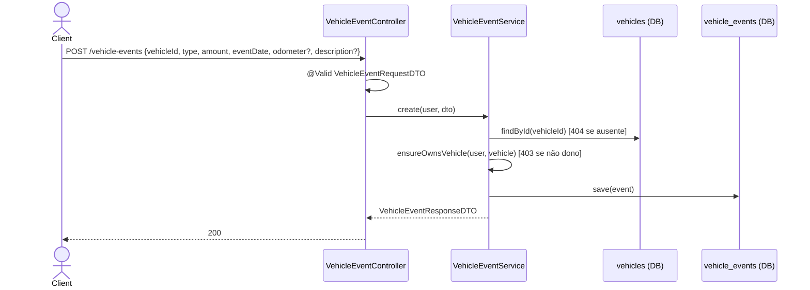

# Fluxo de Endpoints — Eventos de Veículo

> Fonte: `vehicleevent/VehicleEventController.java`, `vehicleevent/VehicleEventService.java`, `vehicleevent/VehicleEventRepository.java`, `vehicleevent/VehicleEvent.java`, `common/AuthorizationHelper.java`, `config/GlobalExceptionHandler.java`.

Controller: `@RequestMapping("/vehicle-events")` (`VehicleEventController.java:17`). Mesma cadeia de middleware dos demais recursos protegidos (JWT obrigatório, sem rate limit). Nenhum método é `@Transactional`.

## `POST /vehicle-events` — criar

Fonte: `VehicleEventService.java:26-41`. Validação Bean (`VehicleEventRequestDTO.java:20-39`): `vehicleId`/`type`/`amount`/`eventDate` `@NotNull`; `amount` `@DecimalMin("0.01") @Digits(integer=10, fraction=2)`; `eventDate` `@PastOrPresent` (rejeita data futura); `odometer` opcional `@PositiveOrZero`; `description` `@Size(max=2000)`.

**Diferenças relevantes em relação a Abastecimentos:**
- Não há nenhuma validação de regra de negócio equivalente (sem faixa de preço, sem checagem de capacidade, sem monotonicidade de odômetro contra o último registro).
- Apesar de a entidade ter campo `odometer`, **não há atualização de `vehicle.currentKm`** na criação de evento — diferente do que ocorre em `Refuel`.
- Não há campo calculado (`totalAmount` equivalente): `amount` é gravado exatamente como enviado pelo cliente, sem `@PrePersist`.

## `GET /vehicle-events/vehicle/{vehicleId}` — listar (filtro tipo/data)

`VehicleEventService.getVehicleEvents` (`:71-96`): `findOwned` (404/403), depois 4 variações de query conforme os filtros presentes — `type`+datas, só `type`, só datas, ou nenhum filtro (`VehicleEventRepository.java:13-33`). Mesma limitação dos abastecimentos: as variações "com data" exigem **ambos** `startDate` e `endDate` simultaneamente; um único parâmetro de data não filtra nada. Todas as variações ordenam por `eventDate DESC, createdAt DESC, id DESC` — critério de desempate determinístico (mais robusto que a ordenação só por data usada em `Refuel`).

`type` inválido na query (string fora do enum `VehicleEventType`) gera `MethodArgumentTypeMismatchException`, sem handler dedicado em `GlobalExceptionHandler` → cai no genérico → **500** em vez de `400`. `[descoberto na Fase 4 — mesmo gap de Refuel]`

## `GET /vehicle-events/{id}` — detalhe

`findById` (404) + `authorizationHelper.ensureOwnsEvent(user, event)` (`AuthorizationHelper.java:25-29`, compara `event.getVehicle().getUser().getId()`) → 403 se não for dono.

## `PUT /vehicle-events/{id}` — atualizar (parcial)

`VehicleEventService.update` (`:50-62`): `findById` (404) + `ensureOwnsEvent` (403). Campos `type`, `amount`, `description`, `odometer`, `eventDate` são atualizados individualmente apenas se não-nulos no request — **sem nenhuma validação de negócio adicional** (não revalida faixa de preço/capacidade/monotonicidade, ao contrário de `Refuel.updateRefuel`). `vehicleId` do corpo também é ignorado aqui (evento não pode trocar de veículo via update).

**Atenção:** `description` só é atualizado se não-nulo — não existe forma de **limpar** uma descrição existente via este endpoint (enviar `null` é interpretado como "não alterar", não como "remover"). `[descoberto na Fase 4]`

Mesma inconsistência de `Refuel`: o DTO marca `vehicleId`/`type`/`amount`/`eventDate` como `@NotNull`, mas o service implementa atualização parcial — um `PUT` que omita esses campos falha a validação Bean antes de a lógica de "parcial" ser exercitada.

## `DELETE /vehicle-events/{id}`

`findById` (404) + `ensureOwnsEvent` (403) + `deleteById`. Retorna `void` → `200` com corpo vazio.

## Tabela de Erros → Status HTTP

| Exceção | Onde | Status | Code |
|---|---|---|---|
| Bearer ausente/inválido | `JwtAuthenticationFilter` | 401 | `AUTH_REQUIRED`/`AUTH_TOKEN_INVALID` |
| `MethodArgumentNotValidException` | `@Valid` no body | 400 | `VALIDATION_FAILED` |
| `eventDate` no futuro | `@PastOrPresent` (Bean Validation) | 400 | `VALIDATION_FAILED` |
| Enum `type` inválido em query param | Spring MVC (sem handler dedicado) | 500 | `INTERNAL_ERROR` |
| Veículo/evento não encontrado | `VehicleEventService` | 404 | `RESOURCE_NOT_FOUND` |
| Não é dono do veículo/evento | `AuthorizationHelper` | 403 | `FORBIDDEN_OPERATION` |
| Erro inesperado | catch-all | 500 | `INTERNAL_ERROR` |

## Pontos de Atenção

- Eventos de veículo não possuem nenhuma camada de validação de regra de negócio equivalente à de Abastecimentos (sem faixa de preço, sem checagem de capacidade, sem monotonicidade de odômetro). `[INFERIDO — pode ser intencional, já que eventos cobrem categorias muito mais heterogêneas que abastecimento]`
- Diferente de `Refuel`, criar um evento com `odometer` não atualiza `vehicle.currentKm` — comportamento assimétrico entre os dois domínios que compartilham o conceito de odômetro. `[descoberto na Fase 4]`
- `type`/data malformados em query params caem em erro genérico `500` em vez de `400` (mesmo gap identificado em Abastecimentos). `[descoberto na Fase 4 — gap]`
- `description` não pode ser explicitamente limpado via `PUT` (semântica "ignora null" trata ausência e remoção da mesma forma). `[descoberto na Fase 4]`
- `VehicleEventType.FUEL` continua parecendo redundante com `RefuelType.FUEL` (já apontado na Fase 1) — não há nenhuma sincronização entre os dois conceitos no código deste módulo. `[INFERIDO — confirmar com time]`
