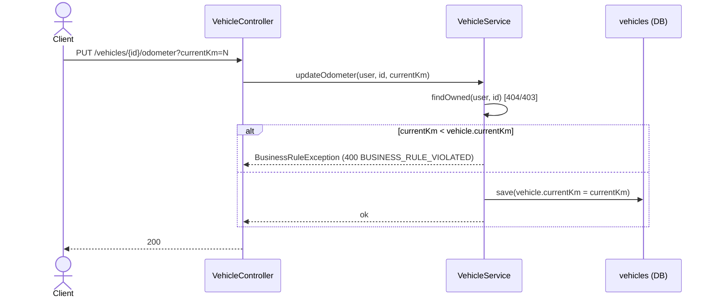
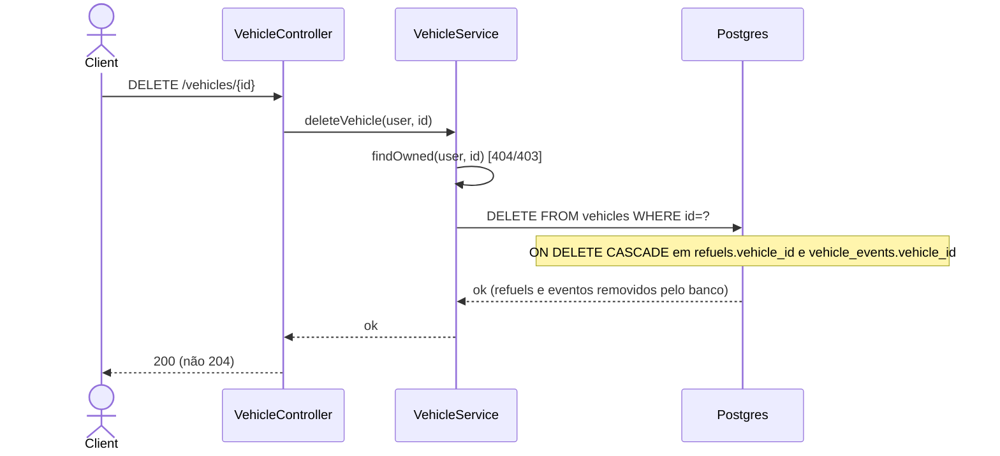

# Fluxo de Endpoints — Veículos

> Fonte: `vehicle/VehicleController.java`, `vehicle/VehicleService.java`, `vehicle/VehicleRepository.java`, `common/AuthorizationHelper.java`, `config/JwtAuthenticationFilter.java`, `config/GlobalExceptionHandler.java`, `db/migration/V1__baseline.sql`, `db/migration/V5__vehicle_events.sql`.

Controller: `@RequestMapping("/vehicles")` (`VehicleController.java:16`), sem prefixo `/api/v1` (mesma observação da Fase 1/2).

## Cadeia de middleware (comum)

`JwtAuthenticationFilter` sempre executa para `/vehicles/**` (não está na lista de isenção) — Bearer ausente/inválido é resolvido **no filtro**, sem chegar ao controller (401 `AUTH_REQUIRED`/`AUTH_TOKEN_INVALID`). `RateLimitFilter` não se aplica (só intercepta paths de `/auth` configurados). Nenhuma rota de veículo é pública.

**Caso de borda no filtro JWT:** se o token é válido mas o e-mail do subject não resolve a nenhum usuário (`userRepository.findByEmail` vazio), o filtro segue **sem autenticar** (`ifPresent` silencioso) — a requisição cai no `anyRequest().authenticated()` do `SecurityConfig` e retorna 401 pelo entry point, mas `@AuthenticationPrincipal User user` ficaria `null` se esse caminho não fosse interceptado antes. `[INFERIDO — não testado diretamente]`

## Padrão comum: `findOwned`

Toda operação sobre um veículo específico passa por `VehicleService.findOwned(user, id)` (`VehicleService.java:88-93`):
1. `vehicleRepository.findById(id)` → ausente → `ResourceNotFoundException` 404.
2. `authorizationHelper.ensureOwnsVehicle(user, vehicle)` (`AuthorizationHelper.java:13-17`) → `vehicle.getUser().getId() != user.getId()` → `ForbiddenOperationException` 403.

**Atenção:** a checagem de existência ocorre *antes* da checagem de dono — um ID de veículo de outro usuário retorna `403` (confirma que o recurso existe) em vez de `404`. Possível vazamento de informação. `[INFERIDO]`

## `POST /vehicles` — criar

```mermaid
sequenceDiagram
    actor Client
    participant API as VehicleController
    participant Svc as VehicleService
    participant DB as vehicles (DB)

    Client->>API: POST /vehicles {type, energyType, currentKm, capacity, ...}
    API->>API: @Valid VehicleRequestDTO
    alt validação falha
        API-->>Client: 400 VALIDATION_FAILED
    else válido
        API->>Svc: createVehicle(user, dto)
        Svc->>Svc: new Vehicle(); applyRequestToVehicle(dto); vehicle.setUser(user)
        Svc->>DB: save(vehicle)
        Svc-->>API: VehicleResponseDTO
        API-->>Client: 200 (não 201)
    end
```

Fonte: `VehicleController.java:22-27`, `VehicleService.java:25-30`. **Atenção:** apesar de ser uma criação, o controller devolve `200` (método retorna o DTO direto, sem `@ResponseStatus(CREATED)`), não `201`.

## `GET /vehicles` (lista paginada) e `GET /vehicles/active`

- Lista: `findByUserId(user.getId(), pageable)` (`VehicleRepository.java:14`) — filtro por usuário já na query, sem checagem adicional de ownership por item.
- Ativo: `getActiveVehicle` (`VehicleService.java:38-44`) carrega **todos** os veículos do usuário (`findByUserId` não paginado) e filtra em memória por `isActive == true`, pegando o primeiro. Nenhum encontrado → `ResourceNotFoundException` 404. Existe `findByUserIdAndIsActiveTrue` no repositório (`VehicleRepository.java:16`) que faria essa busca direto no banco, mas **não é usado** — código morto / otimização perdida. `[descoberto na Fase 4]`

## `GET /vehicles/{id}` / `PUT /vehicles/{id}`

`findOwned` (404/403) seguido de leitura ou de `applyRequestToVehicle` (`VehicleService.java:95-108`, copia apenas campos não-nulos do DTO) + `save`. O `PUT` reaplica a validação completa do `VehicleRequestDTO` (mesmos `@NotNull`/`@NotBlank` do `POST`), então a lógica de "ignorar campo nulo" do `applyRequestToVehicle` é, na prática, inalcançável para os campos obrigatórios — parece lógica de PATCH residual num endpoint que de fato exige PUT completo. `[descoberto na Fase 4]`

## `PUT /vehicles/{id}/odometer`



Fonte: `VehicleController.java:56-62`, `VehicleService.java:57-64`. `currentKm` é `@RequestParam Integer` **sem** anotação de validação (`@Min` etc.) — query param ausente ou não numérico gera `MissingServletRequestParameterException`/`MethodArgumentTypeMismatchException`, que **não tem handler dedicado** em `GlobalExceptionHandler` e cai no genérico → **500** em vez de `400`. `[descoberto na Fase 4 — gap]`

## `PUT /vehicles/{id}/active`

`setActiveVehicle` (`VehicleService.java:66-72`): confirma ownership via `findOwned` (resultado descartado), depois carrega **todos** os veículos do usuário (`findByUserId`, sem paginação), seta `isActive = (v.getId().equals(vehicleId))` em memória para cada um e persiste em lote com `saveAll`. Garante "exatamente um veículo ativo por usuário", mas via leitura/escrita completa da lista em vez de um único `UPDATE`. Sem `@Transactional` agregando as duas leituras + a escrita — cada chamada de repositório roda em sua própria transação implícita.

## `DELETE /vehicles/{id}` — cascade



Fonte: `VehicleService.java:74-77`. Não há cascade manual em código — é inteiramente delegado ao banco via FK `ON DELETE CASCADE` (`db/migration/V1__baseline.sql:47` para `refuels`, `V5__vehicle_events.sql:7` para `vehicle_events`). `Refuel.java` declara `@OnDelete(action=CASCADE)` (hint só de DDL do Hibernate, sem efeito real pois o schema é gerido por Flyway); `VehicleEvent.java` não tem a mesma anotação, embora o comportamento real (cascade no banco) seja idêntico — assimetria de anotações entre as duas entidades sem impacto funcional. **Atenção:** método retorna `void` → `200` com corpo vazio, não `204`.

## Tabela de Erros → Status HTTP

| Exceção | Onde | Status | Code |
|---|---|---|---|
| Bearer ausente/inválido | `JwtAuthenticationFilter` | 401 | `AUTH_REQUIRED` / `AUTH_TOKEN_INVALID` |
| `MethodArgumentNotValidException` | binding do body `@Valid` | 400 | `VALIDATION_FAILED` |
| Erro de binding em `@RequestParam Integer currentKm` | Spring MVC (sem handler dedicado) | 500 | `INTERNAL_ERROR` |
| Veículo não encontrado | `VehicleService.findOwned`/`getActiveVehicle` | 404 | `RESOURCE_NOT_FOUND` |
| Veículo não pertence ao usuário | `AuthorizationHelper.ensureOwnsVehicle` | 403 | `FORBIDDEN_OPERATION` |
| Odômetro menor que o atual | `VehicleService.updateOdometer` | 400 | `BUSINESS_RULE_VIOLATED` |
| Violação de constraint no banco | `DataIntegrityViolationException` | 409 | `CONFLICT` |
| Erro inesperado | catch-all | 500 | `INTERNAL_ERROR` |

Nenhum evento, fila, cache ou efeito assíncrono — apenas logging padrão SLF4J nos filtros/handler.

## Pontos de Atenção

- `POST /vehicles` retorna `200` em vez de `201` para uma criação. `[descoberto na Fase 4]`
- `DELETE /vehicles/{id}` e `PUT /vehicles/{id}/active` retornam `200` com corpo vazio em vez de `204`. `[descoberto na Fase 4]`
- `findOwned` checa existência antes de checar dono — vazamento potencial de existência via diferença `404` vs `403`. `[INFERIDO]`
- `findByUserIdAndIsActiveTrue` existe no repositório mas nunca é chamado — código morto. `[descoberto na Fase 4]`
- Query param `currentKm` sem `@Min`/validação e sem handler de erro de binding → 500 em vez de 400 para entrada inválida do cliente. `[descoberto na Fase 4 — gap]`
- `applyRequestToVehicle` tem lógica de "atualização parcial" inalcançável porque o DTO de `PUT` exige os mesmos campos obrigatórios do `POST`. `[descoberto na Fase 4]`
