# FlowFuel

[](https://github.com/Rochafelip/flowfuel-app/releases/latest)
[](https://kotlinlang.org)
[](LICENSE)

App Android para controle de combustível e manutenção de veículos, com prontuário financeiro por veículo: abastecimentos, manutenções, seguro, IPVA e outras despesas — tudo em um só lugar, com dashboard de consumo, histórico exportável e integração com Android Auto.

<p align="center">
  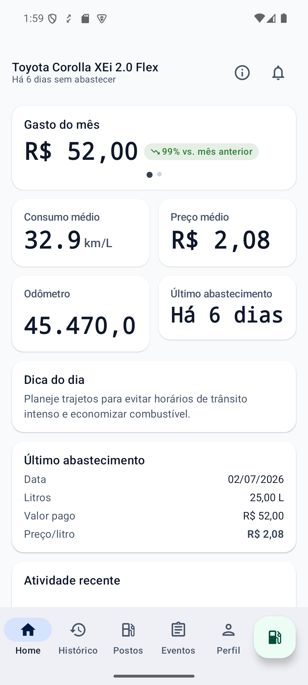
  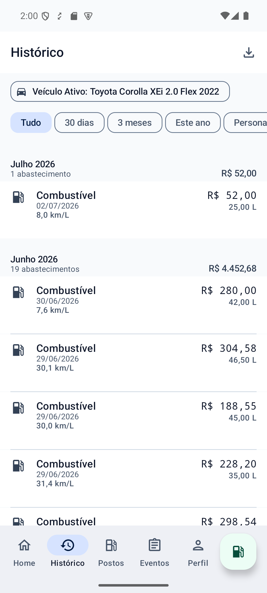
  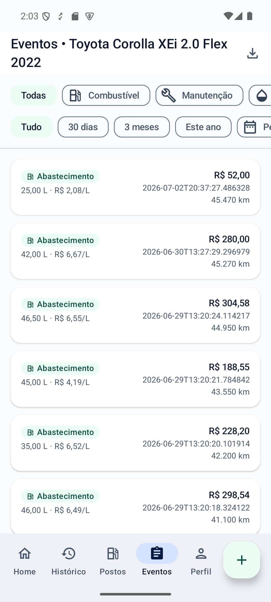
  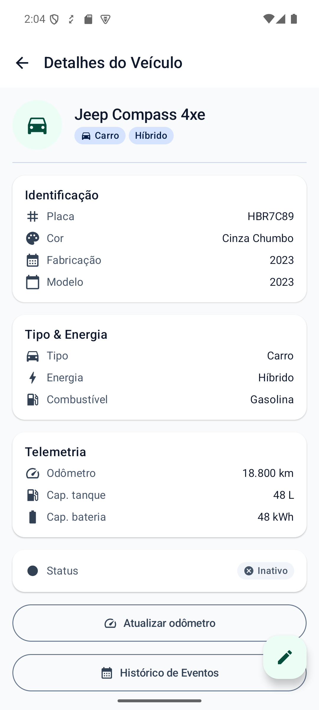
</p>

## Funcionalidades

### Autenticação e perfil

Cadastro por e-mail/senha com confirmação de conta (magic link ou token manual), recuperação de senha, edição de perfil com foto e troca de senha.

<p align="center">
  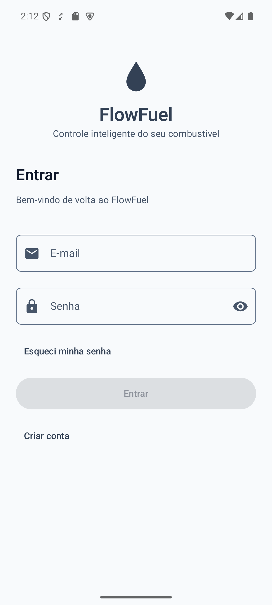
  
  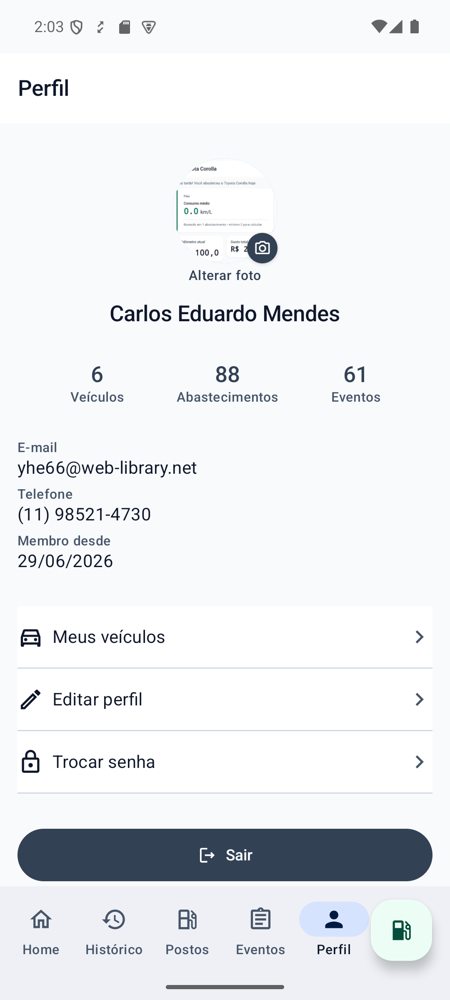
</p>

### Dashboard (Home)

Resumo financeiro do mês com variação em relação ao mês anterior, indicadores de consumo médio, preço médio e odômetro, dica do dia, dados do último abastecimento, atividade recente e alertas de manutenções futuras (licenciamento, troca de óleo, rodízio de pneus).

<p align="center">
  
</p>

### Registro rápido de abastecimento

Acessível pelo botão flutuante em qualquer aba: alterna entre informar o percurso (km rodados) ou o odômetro absoluto, aceita litros ou kWh (veículos elétricos/híbridos) e marca se o tanque ficou cheio — usado para calcular o consumo médio automaticamente.

<p align="center">
  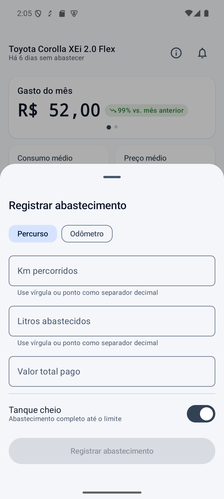
  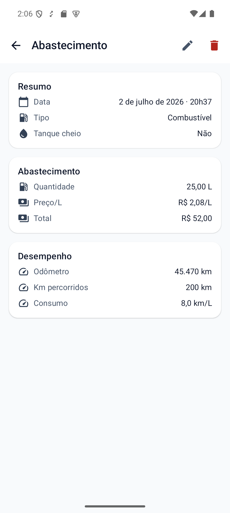
</p>

### Veículos

Suporte a carros e motos, com energia por combustão, elétrica ou híbrida (e o respectivo tipo de combustível — gasolina, etanol, diesel, flex ou GNV). Cadastro em wizard de 4 passos (identificação, classificação, dados técnicos e foto), lista de gestão com troca do veículo ativo e edição completa.

<p align="center">
  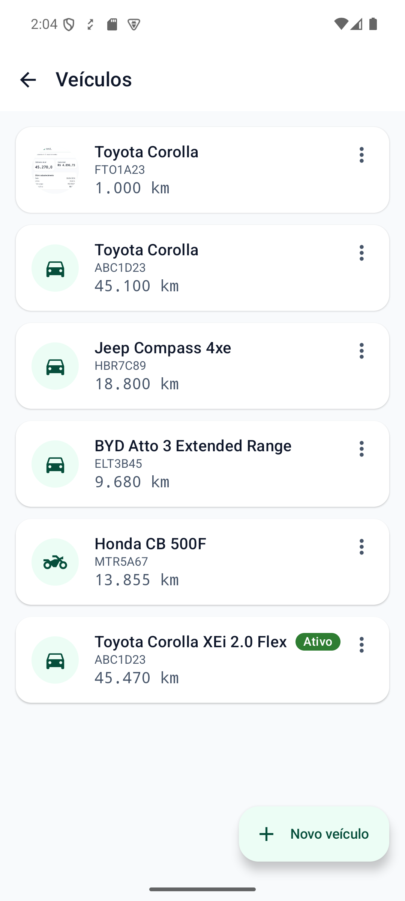
  
  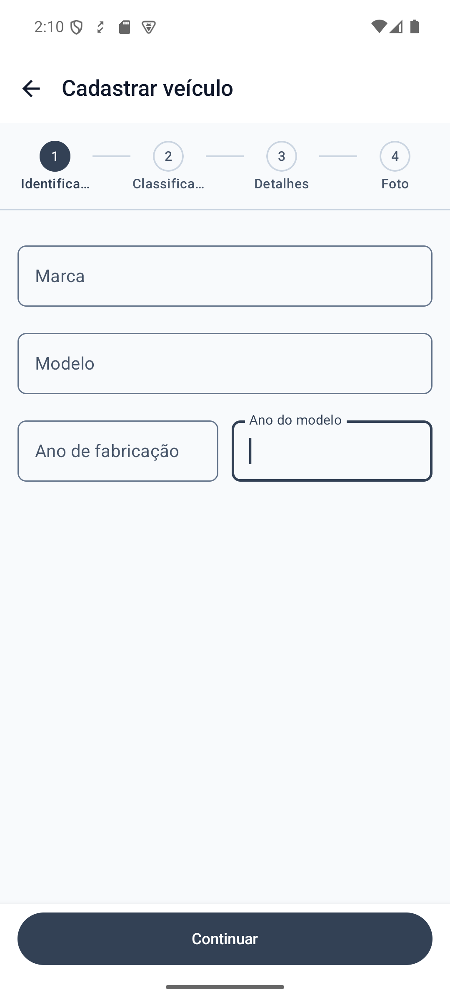
</p>

### Histórico e eventos financeiros

Histórico de abastecimentos agrupado por mês com filtros de período. Linha do tempo de eventos combinando abastecimentos e despesas por categoria (manutenção, troca de óleo, lavagem, pneus, seguro, imposto, documentos e outros), com filtro por categoria/data e exportação em CSV ou PDF.

<p align="center">
  
  
</p>

### Postos próximos

Busca de postos de combustível ou eletropostos nas proximidades via geolocalização, com filtro por raio de distância e abertura de rota no app de navegação do dispositivo.

<p align="center">
  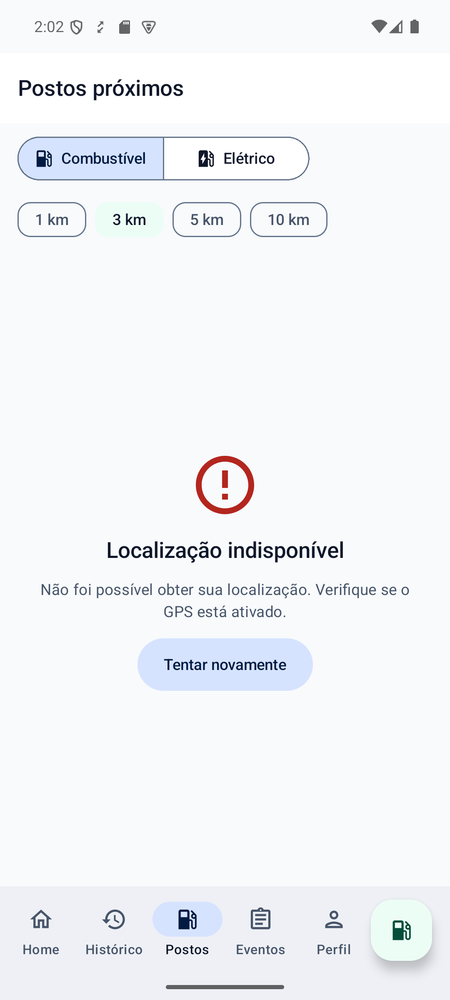
</p>

### Android Auto

Mini-app dedicado (`feature/auto`) com login e um fluxo simplificado de 3 passos para registrar abastecimento direto do painel do carro, sem precisar pegar o celular.

### Atualização automática

Em builds de release, o app verifica em segundo plano se há uma versão mais nova publicada no GitHub Releases e avisa com um diálogo com a identidade visual do FlowFuel — sem changelog cru do GitHub. Ao confirmar, o download roda via `DownloadManager` com barra de progresso real (porcentagem e tamanho baixado), e a instalação é acionada automaticamente assim que o APK termina de baixar.

<p align="center">
  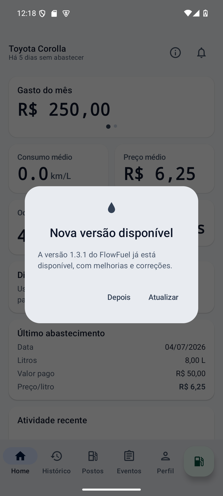
  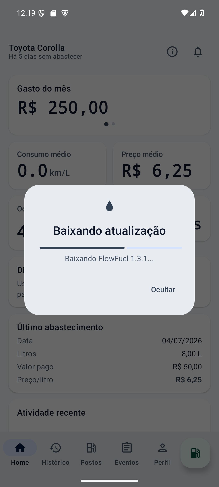
</p>

## Stack

- Kotlin + Jetpack Compose (Material 3)
- Arquitetura MVVM (ViewModel + StateFlow)
- Hilt para injeção de dependência
- Retrofit + OkHttp + kotlinx.serialization para acesso à API
- Room + DataStore para persistência local
- WorkManager para tarefas em background
- Coil para carregamento de imagens
- Sentry para monitoramento de crashes
- Testes com JUnit5, MockK, Turbine e Robolectric

## Estrutura

```
app/src/main/java/com/flowfuel/app/
├── core/          # infraestrutura compartilhada (rede, DI, design system, etc.)
├── feature/
│   ├── auth/          # login, cadastro, ativação de conta e perfil
│   ├── onboarding/    # fluxo inicial
│   ├── home/          # dashboard e registro rápido de abastecimento
│   ├── vehicle/       # cadastro e gestão de veículos
│   ├── vehicleevent/  # eventos financeiros do veículo (abastecimentos, manutenções, despesas)
│   ├── history/       # histórico de abastecimentos
│   ├── station/       # postos próximos
│   ├── export/        # exportação de dados (CSV/PDF)
│   └── auto/          # integração com Android Auto
└── navigation/    # grafo de navegação
```

O design system próprio (`core/designsystem`) segue Material 3 com tema claro/escuro automático, componentes reutilizáveis prefixados com `FF*` (`FFButton`, `FFCard`, `FFBottomSheet`, etc.) e uma paleta em tons de slate/grafite com verde-esmeralda como cor de destaque da marca.

## Build

Requer JDK 17 e Android SDK 35.

```bash
./gradlew assembleDebug
```

Configurações locais (URL da API de desenvolvimento, DSN do Sentry, keystore de release) vão em `local.properties` — veja o template comentado nesse arquivo.

## Dados de demonstração

Os scripts em `scripts/` populam uma conta de teste com veículos (combustão, elétrico e híbrido) e meses de histórico de abastecimentos/eventos via API, úteis para testar a UI com dados realistas:

```bash
./scripts/seed-demo-account.ps1
./scripts/seed-demo-extra.ps1
```

## Release

Builds de release são assinados e publicados automaticamente como GitHub Release sempre que uma tag `vX.Y.Z` é enviada ao repositório (ver `.github/workflows/release.yml`).

```bash
git tag v1.1.1
git push origin v1.1.1
```

## Licença

Distribuído sob a licença MIT — veja [LICENSE](LICENSE) para o texto completo.

© 2026 [Rochafelip](https://github.com/Rochafelip)
